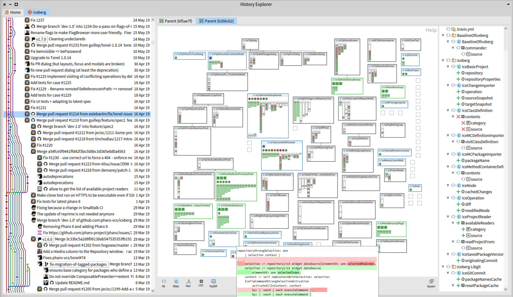

# Rita

[](https://github.com/tinchodias/pharo-rita-history/actions/workflows/tests.yml)

A tool to help understanding git code changes in Pharo IDE.
Inspired on [Torch](http://rmod.inria.fr/archives/papers/Uqui10a-Torch-WCRE10.pdf).



## Install

Load in Pharo 13 with:

```smalltalk
Metacello new
	baseline: 'Rita';
	repository: 'github://tinchodias/pharo-rita-history:Pharo13/src';
	load
```

Then, click on `World Menu -> Tools -> Rita`.

## Install via Bash script:

Alternatively, we provide a bash script that downloads Pharo and installs the project. Open a terminal, create a directory and execute:
1. `git clone https://github.com/tinchodias/pharo-rita-history.git`
2. `cd pharo-rita-history`
3. `./script/build.sh`
4. `cd build`
5. `./pharo-ui Pharo.image`

In fact, you can execute the script from other directory, no need to be there the git repository was cloned.

To start Rita, do: `cd build` and `./pharo-ui Pharo.image`.
Then, click on `World Menu -> Tools -> Rita`.

---

## License

The code is licensed under [MIT](LICENSE).

## What's *rita*?

It comes from "Santa Rita", the name of [this plant](https://es.wikipedia.org/wiki/Bougainvillea) in Argentina:


