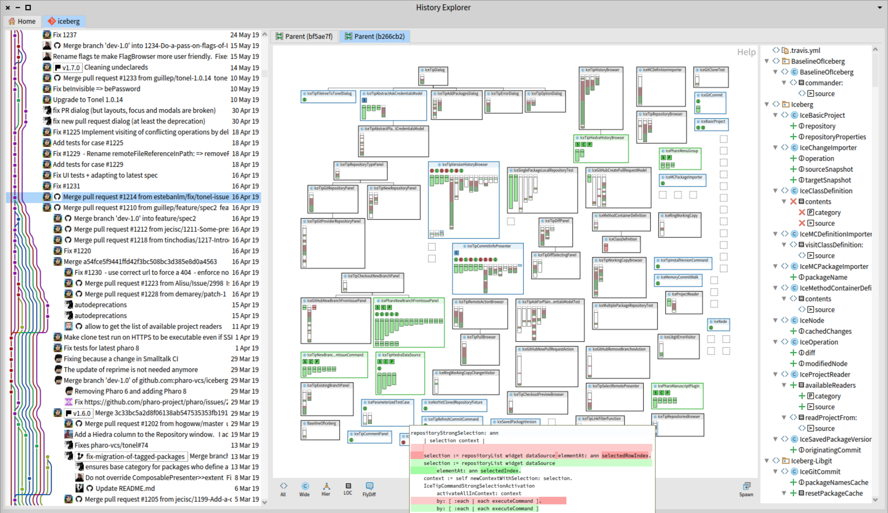

# Rita

This repository is home of several experiments on understanding of code changes with Pharo inspired in [Torch](http://rmod.inria.fr/archives/papers/Uqui10a-Torch-WCRE10.pdf).

## Install

In Pharo 8:

~~~Smalltalk
    Metacello new
        githubUser: 'pharo-spec' project: 'Spec' commitish: 'v0.7.0' path: 'src';
        baseline: 'Spec2';
        onConflict: [ :e | e useIncoming ];
        onUpgrade: [ :e | e useIncoming ];
        ignoreImage;
        load.

    Metacello new 
        baseline: 'Rita'; 
        repository: 'github://tinchodias/pharo-rita-history/';
        onConflict: [ :e | e useLoaded ];
        onUpgrade: [ :e | e useLoaded ];
        ignoreImage;
        load.
~~~

**NOTE**: A window will ask if you want to Load or Merge the project named Hiedra. Load is good.

## Execute

Click on `World Menu -> Tools -> Rita`.

or evaluate:

~~~Smalltalk
RiRootPresenter open
~~~

---

## License
The code is licensed under [MIT](LICENSE).

## What's *rita*?

It comes from "Santa Rita", the name of [this plant](https://es.wikipedia.org/wiki/Bougainvillea) in Argentina:

